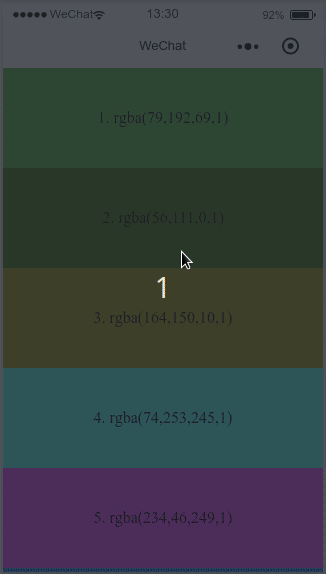

# wx-pulltorefresh-view

> wx-pulltorefresh-view是小程序基础组件的扩展，不定期更新

## 组件简介

|组件名|目录|扩展组件|扩展内容|
|---|---|---|---|
|wx-pulltorefresh-view|/components/wx-pulltorefresh-view|[scroll-view](https://mp.weixin.qq.com/debug/wxadoc/dev/component/scroll-view.html)|增加scroll-view自身的下拉和上拉刷新功能|

- wx-pulltorefresh-view下拉刷新效果：



## 使用方法

1. 下载代码

1. 复制文件夹 `wx-pulltorefresh-view` 到你自己的项目中

1. 在需要使用相关组件的页面的 `json` 文件中进行引用声明。此时需要提供每个自定义组件的标签名和对应的自定义组件文件路径：

    ```javascript
    {
      "usingComponents": {
        "pulltorefresh-view": "../../components/wx-pulltorefresh-view/wx-pulltorefresh-view"
      }
    }
    ```

1. 在页面的 `wxml` 中就可以像使用基础组件一样使用自定义组件。节点名即自定义组件的标签名，节点属性即传递给组件的属性值。

    ```xml
    <view>
      <x-tag-name attr-name="attr-value"></x-tag-name>
    </view>
    ```

    > 参考：[自定义组件官方文档](https://mp.weixin.qq.com/debug/wxadoc/dev/framework/custom-component/)

## 组件文档

### wx-pulltorefresh-view

|属性名|类型|默认值|说明|
|---|---|---|---|
|pull-text|String|下拉可以刷新|下拉还不能刷新时显示的文字|
|release-text|String|松开立即刷新|下拉至可刷新时显示的文字|
|loading-text|String|正在刷新数据中|刷新时显示的文字，尾部会自动接 `...` |
|finish-text|String|刷新完成|刷新完成时显示的文字|
|pull-up-text|String|上拉加载更多|上拉加载更多时显示的文字|
|pull-up-release-text|String|松开立即加载|松开立即加载时显示的文字|
|loadmore-text|String|正在加载更多数据|上拉加载更多时显示的文字|
|loadmore-finish-text|String|加载完成|加载完成时显示的文字|
|nomore-text|String|已经全部加载完毕|上拉加载无数据后显示的文字|
|refreshing|Boolean|false|是否正在刷新|
|nomore|Boolean|false|是否没有更多数据（加载完毕）|
|disablePullDown|Boolean|false|是否开启下拉|
|bindpulldownrefresh|HandleEvent||当下拉刷新时触发|
|bindloadmore|HandleEvent||当滚动到底部时触发|

**注意：**

1. 触发 `pulldownrefresh` 事件时，组件的 `refreshing` 属性要设为 `true` ，刷新完成后将其设为 `false` 以完成刷新
2. 当没有更多数据时，将组件的 `nomore` 属性设为 `true`
3. 每页内容总高度应大于组件的高度，否则在底部加载时会出现问题，因此在当前页确定为最后一页时（如内容不足一页）就应该将 `nomore` 设为 `true`

**示例**

```xml
<view class="page-index">
  <pulltorefresh-view style="height:100%" nomore="{{nomore}}" refreshing="{{refreshing}}" bindpulldownrefresh="refreshData" bindloadmore="loadmoreData">
    <view class="list-item" wx:for="{{colors}}" wx:for-index="index" wx:key="index" style="background: {{item}}">{{index + 1}}. {{item}}</view>
  </pulltorefresh-view>
</view>
```

```javascript
Page({
  data: {
    colors: [],
    refreshing: false,
    nomore: false,
  },
  randomColor: function () {
    return `rgba(${Math.floor(Math.random() * 256)},${Math.floor(Math.random() * 256)},${Math.floor(Math.random() * 256)},1)`;
  },
  generateColors: function (length) {
    return new Array(length).fill(null).map(() => this.randomColor());
  },
  onLoad: function () {
    const colors = this.generateColors(10);
    this.setData({
      colors: colors,
    });
  },
  refreshData: function () {
    this.setData({
      refreshing: true,
    })
    setTimeout(() => {
      const colors = this.generateColors(10);
      this.setData({
        colors,
        refreshing: false,
        nomore: false,
      });
    }, 2000);
  },
  loadmoreData: function () {
    this.setData({
      refreshing: true,
    })
    setTimeout(() => {
      if (this.data.colors.length > 10) {
        this.setData({
          nomore: true,
        })
      } else {
        const colors = this.generateColors(8);
        this.setData({
          colors: [...this.data.colors, ...colors],
        });
      }
      this.setData({
        refreshing: false,
      })
    }, 2000);
  },
})
```